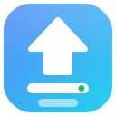

<p align="center">
  
</p>

<h1 align="center">LocalDeploy</h1>

<p align="center">
  <strong>Pick, deploy &amp; benchmark the best local AI model for your machine — no guessing required.</strong>
</p>

<p align="center">
  Everything stays on your machine: no cloud inference, no subscriptions, no telemetry.
</p>

<p align="center">
  <a href="https://github.com/iodriller/LocalDeploy/actions/workflows/ci.yml"></a>
  <a href="LICENSE"></a>
  
  
</p>

<p align="center">
  
</p>

---

## Why?

Running a local model with [Ollama](https://ollama.com) is easy. Knowing **which** model to run is not:

| Ollama alone | With LocalDeploy |
|---|---|
| Guess whether a model fits your VRAM | Fit-checked before you pull or deploy: fits / tight / won't fit |
| `ollama run` in a terminal | A browser UI: pull, deploy, chat, unload, switch — one click each |
| Guess which quant tag to pull | Quant advisor: every Q2→F16 variant fit-checked |
| No way to compare models | Live benchmarking: leaderboard, heatmap, speed-vs-quality |
| Pick a model by name and hope | Guided recommendations, ranked by accuracy, speed, and VRAM headroom |
| No record of what you tried | Report cards and deployment manifests, exportable and reproducible |
| No visibility once it's running | Monitor tab: live VRAM/CPU/RAM, throughput, requests |

LocalDeploy runs *on* Ollama (and optionally llama.cpp) — it doesn't replace it. If you already know exactly which model you want, `ollama run` is enough. LocalDeploy is for the more common case: *"I have this GPU — what should I actually run, and how well does it work?"*

## Quick Start

### pip / pipx (any OS)

Prerequisites: Python 3.10+ and [Ollama](https://ollama.com/download) running.

```bash
pipx install localdeploy   # or: pip install localdeploy
localdeploy                # starts the API and opens the UI
```

State (`config.json`, `.env`, `logs/`, `reports/`) lives in `~/.localdeploy` (override with `LOCALDEPLOY_HOME`). `localdeploy --help` lists `--host`, `--port`, `--no-browser`.

### Windows

```powershell
irm https://raw.githubusercontent.com/iodriller/LocalDeploy/main/scripts/install.ps1 | iex
```

Nothing needs to be preinstalled — it offers to install Python and Ollama via winget. Or from a clone:

```powershell
git clone https://github.com/iodriller/LocalDeploy.git
cd LocalDeploy
.\scripts\start.ps1
```

Creates `.env`, `config.json`, and a `.venv`; starts Ollama if installed; opens `http://localhost:8000/ui`. Stop with `.\scripts\stop.ps1`.

No terminal? Double-click **`start.bat`** in the repo folder — same script, works from a plain ZIP download. After `git pull`, run `.\scripts\start.ps1 -Restart` to pick up changes.

### macOS / Linux

Prerequisites: Python 3.10+ and [Ollama](https://ollama.com/download) running.

```bash
git clone https://github.com/iodriller/LocalDeploy.git
cd LocalDeploy
./scripts/start.sh
```

Runs in the foreground, opens the UI when ready. Stop with Ctrl+C.

### Docker (bundles Ollama, no Python needed)

```bash
git clone https://github.com/iodriller/LocalDeploy.git
cd LocalDeploy
docker compose up --build -d
```

Open `http://localhost:8000/ui`. Stop with `docker compose down`. Volumes persist models and profiles across recreation; the host port binds to `127.0.0.1` only. For NVIDIA passthrough, uncomment `deploy.resources` in `docker-compose.yml` ([NVIDIA Container Toolkit](https://docs.nvidia.com/datacenter/cloud-native/container-toolkit/install-guide.html) required).

## Your First 3 Minutes

A fresh install starts **empty on purpose** — no sample models, no phantom profiles.

1. **Check hardware** — GPU, VRAM, CPU, RAM, and a fit budget.
2. **Get a model** — describe your use case and priority (quality, speed, memory, context) for three explained picks, or pull any Ollama tag directly. Either way, it's fit-checked before you download.
3. **Deploy it** — one click, Auto / GPU / CPU placement.
4. **Chat with it** — streamed replies, image attachments for vision models.
5. **Watch it run** — the Monitor tab shows live VRAM, throughput, and requests while it serves.
6. **Benchmark it** — the built-in suite or a use-case pack (coding, structured JSON, reasoning), with repeated-run stats and regression detection.
7. **Auto-pick** — once you've pulled a few models, rank them by accuracy, speed, or VRAM headroom.

No terminal flags, no VRAM math, no trial-and-error pulls. Full UI guide: [docs/UI.md](docs/UI.md)

### Hardware scope

NVIDIA, AMD, Intel, and Apple Silicon, detected via vendor tools and OS telemetry. Fit checks cover single-GPU, multi-GPU splits, and CPU offload. Mixed vendors are never summed into a fictional VRAM pool.

<p align="center">
  
</p>

<p align="center">
  
</p>

More screenshots (including light theme): [docs/SCREENSHOTS.md](docs/SCREENSHOTS.md)

## Benchmarking

- Runs execute sequentially to avoid VRAM contention, streaming per-test results live.
- Repeated runs record native tok/s, variance, Ollama version, model digest, quant, context, and a hardware snapshot.
- CPU, GPU, Auto, and CPU + GPU comparison modes.
- Leaderboard, category heatmap, speed/quality scatter, per-test detail.
- Runs live in browser `localStorage` and export as self-contained HTML/JSON report cards; an opt-in toggle also mirrors them to server-side JSON files.
- Bring your own question set (safe JSON graders, no code execution) or use the built-in suite.

<p align="center">
  
</p>

## Monitoring and reproducibility

- **Monitor tab** — live VRAM/CPU/RAM, per-model throughput and time-to-first-token, and alerts (VRAM pressure, placement mismatches, slow generation) while a model serves. Request history is numeric metadata only — prompts and responses are never stored.
- **Estimates that improve with use** — every deploy compares the pre-load VRAM estimate against what actually got used, and later fit checks for that GPU/model/quant are corrected from that history, always shown as a visible correction, never applied silently.
- **Deployment manifests** — export a running model's exact configuration as YAML/JSON, then validate or recreate it on another machine, with a compatibility report if the hardware differs.
- **Use it elsewhere** — copy-paste config for Open WebUI, Continue, Cline, curl, Python, or JavaScript, generated from the model you just deployed.

## Privacy & Security

- **No telemetry.** Backend URLs are enforced loopback-only in code; nothing about your machine, models, or usage is sent anywhere.
- **Two internet lookups, both opt-out.** Model search (Hugging Face/Ollama library, runs when you search) and a GitHub release check (runs once per page load, no data sent). `OFFLINE=true` blocks both — verified by `python scripts/egress_selftest.py`.
- **Community benchmark sharing is local-only today.** You can preview and save an anonymized snapshot to disk; there's no server to submit it to yet, so nothing is transmitted.
- Binds to `127.0.0.1` by default, single user. `API_TOKEN` is one shared token, not real auth — no TLS, no multi-user isolation. Don't expose it to the internet or an untrusted LAN. See [SECURITY.md](SECURITY.md).
- **No warranty.** LocalDeploy controls local processes, GPU placement, and files on your machine — use it at your own risk. See [SECURITY.md](SECURITY.md#disclaimer) and [LICENSE](LICENSE).

## For Developers

```powershell
.\scripts\start.ps1 -Foreground   # live logs in the terminal
```

- OpenAPI docs at `http://127.0.0.1:8000/docs`.
- **OpenAI-compatible**: `/v1/chat/completions` (streaming, tool calls), `/v1/responses`, `/v1/embeddings`, `/v1/models`. Tool calls are returned to the client, never executed by LocalDeploy. Use `API_TOKEN` as the bearer key when set.
- **Control-plane endpoints**, safe to call directly: `/system/hardware`, `/system/fit-check` and `/system/fit-table`, `/system/monitor`, `/system/manifest/{export,validate,recreate}`, `/system/integration-snippets`, `/system/update-check`.
- **Local runtime providers**: Ollama, llama.cpp, LM Studio, vLLM, Docker Model Runner, and other loopback OpenAI-compatible servers.
- Model profiles live in `config.json`, starting empty and mirroring your machine — pulling a model creates its profile. `config.example.json` documents every field.
- **Desktop packaging** (early): `packaging/localdeploy.spec` builds a standalone Windows tray executable with PyInstaller — `pip install -e ".[packaging]"` then `.\packaging\build.ps1`. Not yet published as a release asset or signed.
- Terminal chat and model comparison: [docs/CLI.md](docs/CLI.md)
- API request schema and limits: [docs/API_OPTIONS.md](docs/API_OPTIONS.md)
- Model catalog with VRAM guidance: [docs/MODELS.md](docs/MODELS.md)
- Tests and local checks: [tests/README.md](tests/README.md) and [CONTRIBUTING.md](CONTRIBUTING.md)

## Contributing

Issues and PRs are welcome — this project favors small, focused changes that keep everything local-first. Start with [CONTRIBUTING.md](CONTRIBUTING.md). Good first contributions: new benchmark questions, curated-catalog models, docs fixes.

## License

[MIT](LICENSE)
