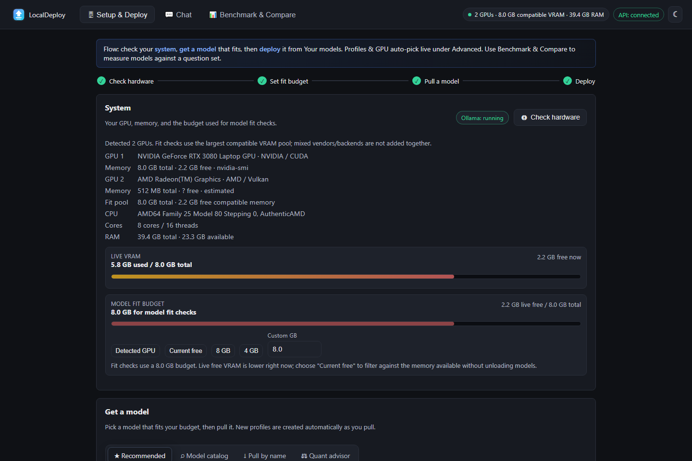
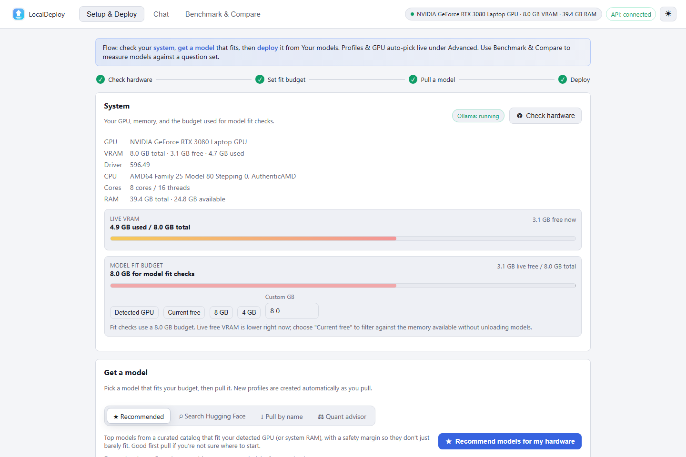
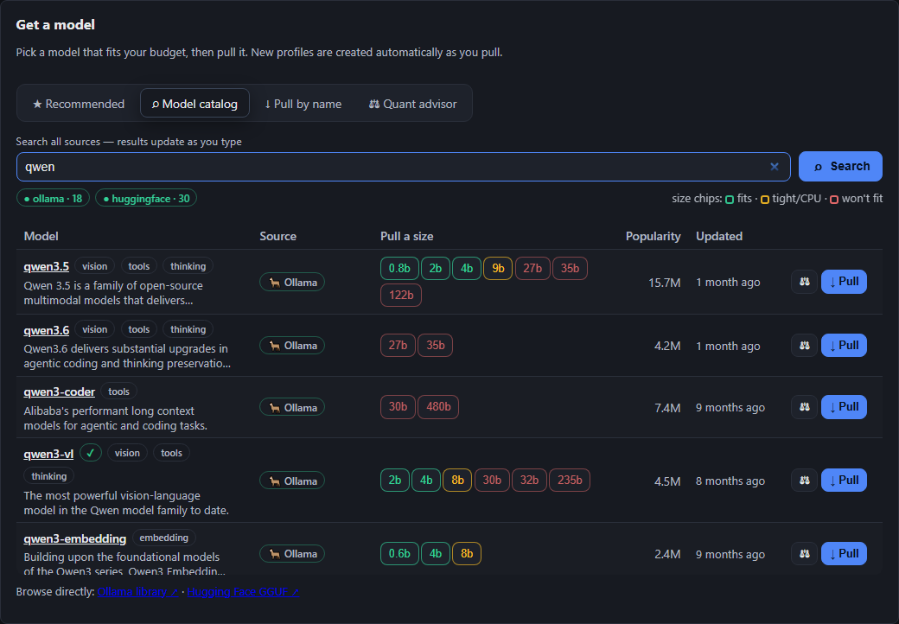
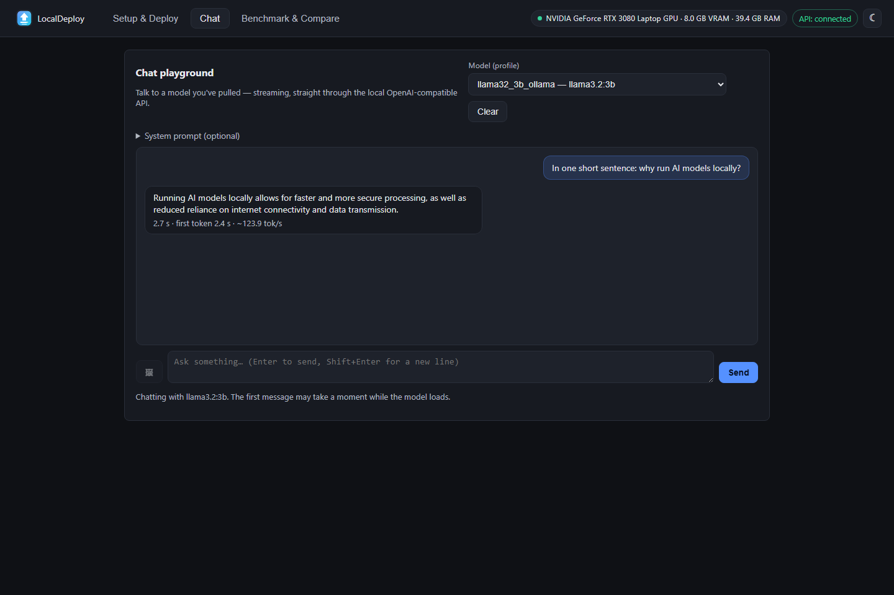
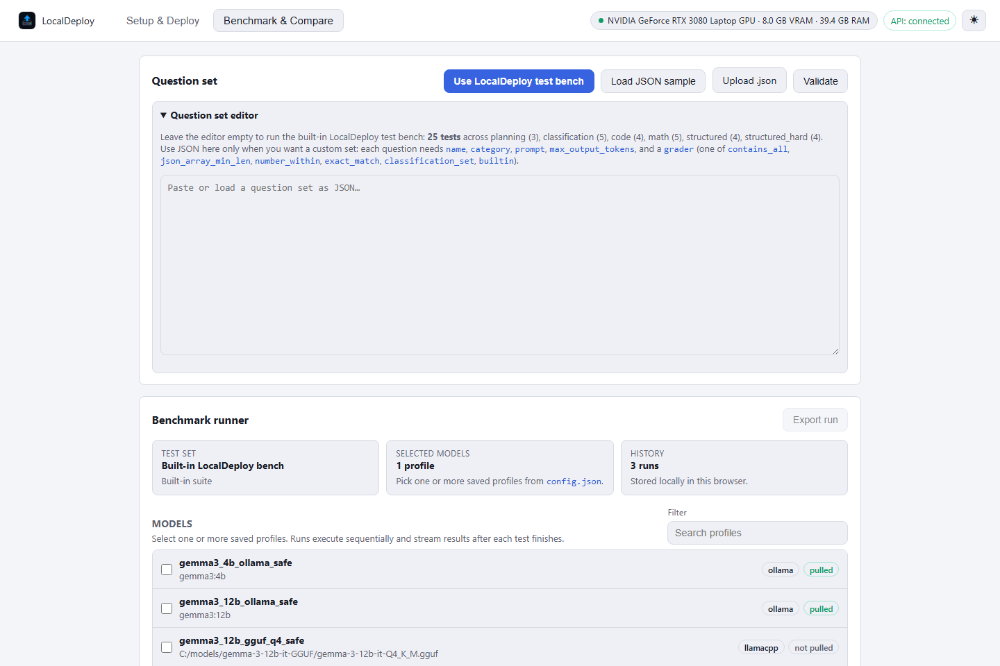

# Screenshots

These images come from the real UI. The capture script seeds a few synthetic benchmark runs so comparison views are populated; it does not replace the interface with a mockup.

## Setup and Deploy





## Model catalog



## Chat



## Benchmark and Compare



## Demo

The README uses [docs/assets/demo.gif](assets/demo.gif), captured by the same tooling.

## Regenerate the files

```powershell
python -m pip install -r requirements-dev.txt
python -m playwright install chromium
python scripts/capture_screenshots.py
python scripts/capture_demo_gif.py
```

The commands overwrite the tracked images. Run them after a layout change and review the result before committing.
